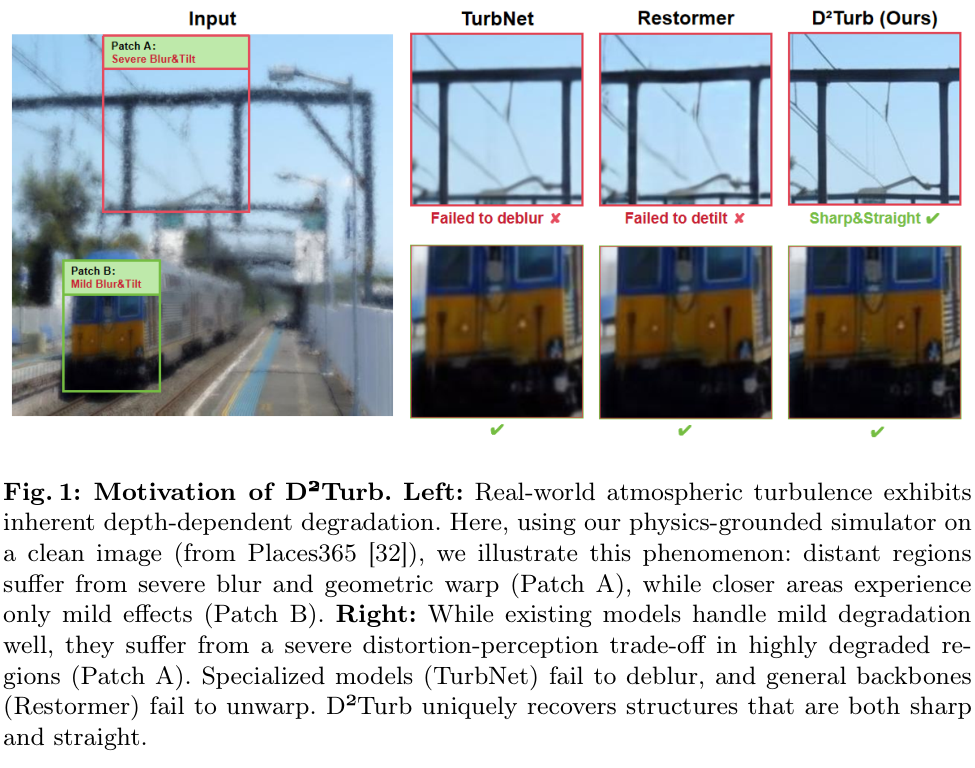

# D2Turb

**Depth-Aware Simulation and Decoupled Learning for Single-Frame Atmospheric Turbulence Mitigation**

[Project Page](https://hertzdot222.github.io/D2Turb/) |
[Paper](https://arxiv.org/abs/2605.27460) |
[Dataset]() |
[Pretrained Models]() |
[Code](code/models/d2turb_restormer.py)

D2Turb addresses single-frame atmospheric turbulence by separating texture
restoration from non-rigid geometric rectification. A depth-aware simulation
model provides spatially varying turbulence and intermediate tilt supervision,
while Adaptive Structural Prior Injection (ASPI) transfers structural cues from
the Restormer restoration stage into the geometric rectifier.



## Highlights

- **Depth-aware simulation:** models spatially varying blur and deformation with scene-depth cues.
- **Decoupled restoration:** separates texture restoration from geometric correction.
- **Structural guidance:** ASPI injects Restormer features into the rectification stage.
- **Inference structure:** public Restormer-based D2Turb model definitions are provided in [`code/models/`](code/models/).
- **Supplementary evidence:** the project page includes additional rectifier, flow inversion, and cross-backbone visual studies.

## Reported Results

| Evaluation | Metric | D2Turb |
| --- | ---: | ---: |
| Synthetic average | PSNR / SSIM / LPIPS | 25.724 / 0.736 / **0.208** |
| Real-world RLR-AT | NIQE / MUSIQ | **6.653** / **52.815** |
| Depth-aware simulation study | NIQE / MUSIQ | 6.980 / 51.996 |

Complete qualitative results, quantitative comparisons, and ablations are
presented on the [project page](https://hertzdot222.github.io/D2Turb/).

## Citation

```bibtex
@article{d2turb,
  title = {D2Turb: Depth-Aware Simulation and Decoupled Learning for
           Single-Frame Atmospheric Turbulence Mitigation},
  journal = {arXiv preprint arXiv:2605.27460},
  year = {2026}
}
```
